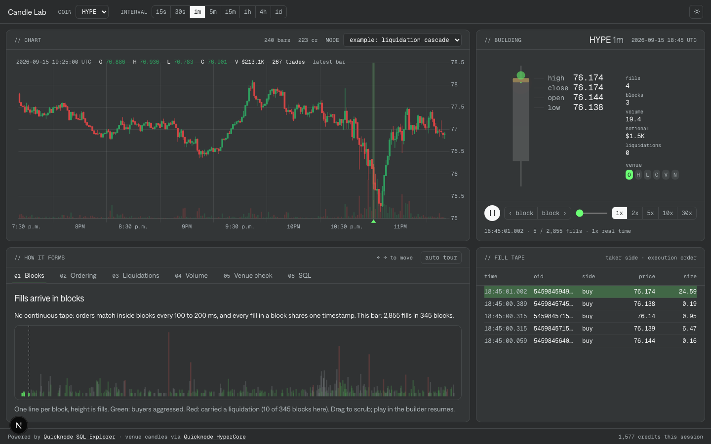

# Candle Lab

Candle Lab shows how a Hyperliquid candle is built, one fill at a time, using data from Quicknode SQL Explorer. Pick any bar of any perp and the app pulls every fill in it, replays them in real time while the candle draws itself, and checks the result against the venue's own candle.

It was built to be recorded. Something is always moving on screen, and every number is real.



## What it does

The screen is four panels.

**Chart.** 240 bars at any interval from 15 seconds to a day. Scroll to zoom, drag to pan once zoomed, click a bar to open it. A crosshair with a dot on the close follows the pointer, and a bubble shows the bar's values. The last bar refreshes every 15 seconds. The mode dropdown switches between replaying the selected bar, following the live bar as it forms, and a worked example: a HYPE minute with a liquidation cascade.

**Building.** The selected bar's fills play back in real time. At 1x a one minute bar takes one minute; longer intervals default to a speed that finishes in about a minute. The wick and body animate as fills land, a dot pings each fill, counters tick up, and six chips (O H L C V N) light up as each value matches the venue. Step block by block, scrub, or click a price label to jump to the fill that set it.

**How it forms.** Six tabs that follow the replay:

1. Fills arrive in blocks. Hyperliquid has no continuous tape. Orders match inside blocks that land every 100 to 200 ms, and every fill in a block shares one timestamp.
2. Open and close are about order. Trade ids are not sequential, so "last trade by id" is a random fill. Sort by block, then aggressor order id, then price along the sweep, and the last row is the real close.
3. High and low skip liquidations. The venue leaves liquidation fills out of the price fields but keeps them in volume and count.
4. Volume keeps everything, and the fills also tell you who aggressed and how much volume was forced.
5. Venue check. The rebuilt bar next to the venue's `candleSnapshot`, field by field.
6. SQL. The exact query for the current window and for the selected bar, with a curl equivalent.

**Fill tape.** The most recent fills, taker side, in execution order.

On screens narrower than a laptop the four panels stack in one scrolling column, the counters move under the candle, and the tab strip scrolls sideways. It was designed for desktop recording, and that is where it looks best.

## How accurate is it

Across 8,640 one minute bars on six coins (HYPE, BTC, ETH, SOL, XRP, DOGE), the rebuilt candles matched the venue on high, low, volume, and trade count on every bar, and on open and close for 99.7% of bars. The remaining 0.3% are bars where stop or take profit orders triggered inside a single block; the fills table does not expose the execution order of triggered orders.

Two rules make this work. Both are in the query below.

- Sort fills by `(block, aggressor order id, price along the sweep)`, not by trade id or timestamp. Trade ids are not monotonic within a block.
- Exclude liquidation fills from open, high, low, and close. Keep them in volume and count.

## The query

```sql
SELECT
  toStartOfInterval(ts, INTERVAL 1 MINUTE) AS t,
  argMinIf(p, (blk, agg_oid, lvl), liq = 0) AS open,
  maxIf(p, liq = 0)                         AS high,
  minIf(p, liq = 0)                         AS low,
  argMaxIf(p, (blk, agg_oid, lvl), liq = 0) AS close,
  sum(s)                                    AS volume,
  sum(usd)                                  AS notional,
  count()                                   AS trades
FROM (
  SELECT
    tid,
    any(time)                                         AS ts,
    any(block_number)                                 AS blk,
    any(price)                                        AS p,
    any(size)                                         AS s,
    anyIf(oid, crossed = 1)                           AS agg_oid,
    anyIf(if(side = 'B', price, -price), crossed = 1) AS lvl,
    max(is_liquidation)                               AS liq,
    toFloat64(any(price)) * toFloat64(any(size))      AS usd
  FROM hyperliquid_fills
  WHERE coin = 'HYPE'
    AND block_time >= '2026-09-15 18:00:00'
    AND block_time <  '2026-09-15 19:00:00'
  GROUP BY tid
)
GROUP BY t
ORDER BY t
```

Change the `INTERVAL` for other bar sizes. The inner `GROUP BY tid` collapses the two rows the fills table stores per trade (maker and taker) and takes the aggressor's order id and side from the row with `crossed = 1`. Prices are multiplied as floats because `Decimal(38,18) * Decimal(38,18)` overflows in ClickHouse.

Fill level history starts 2025-03-23 for every perp. For 1h bars and larger, `hyperliquid_market_volume_hourly` is about 40 times cheaper in credits, but it keeps liquidation fills in high and low, so a few bars differ from the venue by a tick.

## Running it

```bash
pnpm install
cp .env.example .env.local
pnpm dev
```

Two server side secrets, both read only:

| Variable | Purpose |
|---|---|
| `QN_SQL_API_KEY` | SQL Explorer key for the Hyperliquid cluster |
| `QN_HYPERCORE_URL` | Your Quicknode Hyperliquid endpoint base URL. The venue check appends `/info`. |

Set `NEXT_PUBLIC_SITE_URL` in production so Open Graph tags carry the right origin.

The browser never sees either key. `/api/sql` forwards read only `SELECT` queries against `hyperliquid_` tables to SQL Explorer; `/api/venue` calls `candleSnapshot` on your endpoint. Deploy anywhere that runs Next.js server routes.

## Cost

Loading 240 bars costs roughly 200 to 700 SQL Explorer credits depending on the interval. Loading the fills for one busy minute costs about 900, and a tail refresh about 135. The footer keeps a running total for the session.

## Fonts

Onest, self hosted at build time through `next/font`, and Geist Mono for numbers and code, included under the SIL Open Font License.

## Data sources

Fills, blocks, and market data come from [Quicknode SQL Explorer](https://www.quicknode.com/sql-explorer). Venue candles come from the `candleSnapshot` info endpoint on a [Quicknode Hyperliquid](https://www.quicknode.com/docs/hyperliquid) node.
